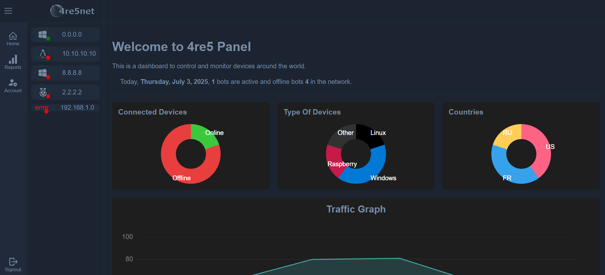
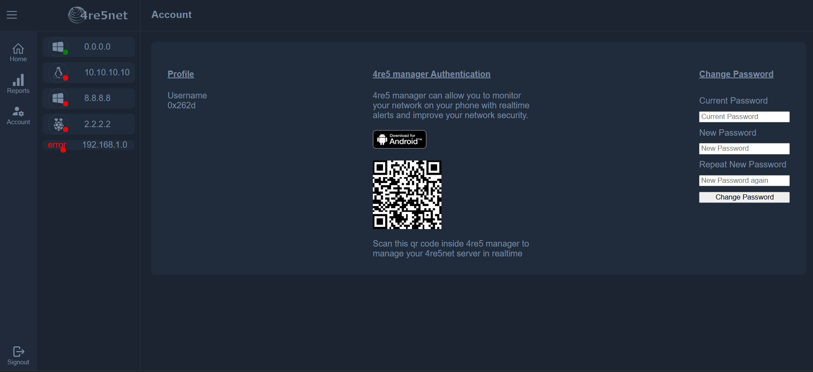

# 4re5net
A light device management panel to handle any type of devices all around the world to build and secure your professional or personal device network

copyrights: 4re5 group - 2025, all rights reserved

## Adventages
- Light and powerfull
- Secured
- Easy to use and fast to deploy
- Data saved locally only without any internet connection required

## Installation
The license to use it could be bought on [our website](https://4re5group.github.io/products/)

### Requirements:
make sure g++17 and jsoncpp, curl and crypto c++ libs are installed
to launch it manually just use `./start.sh`
this will ask you to configurate the panel

## Accounts
You can add an account to your device by using start.sh for the first time.
Accounts can be linked to [4re5 manager](https://github.com/4re5group/4re5-manager) via the avaiable qr code in the profile page

## Pictures

Made with ❤️ by 4re5 group